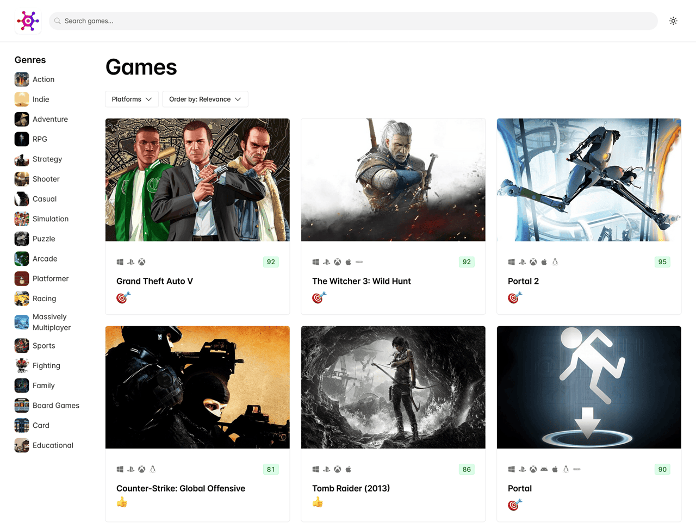

# Video Game Discovery App
A React-based web application designed to help users discover new video games based on their preferences. Built using **Chakra UI** for styling, **React Router** for navigation and **Zustant** as state-management tool, the app allows users to search, filter, and sort through a large database of games using the [RAWG](https://rawg.io/apidocs) API.

Check out the live demo of the app at [https://game-hub-one-sable.vercel.app](https://game-hub-one-sable.vercel.app)

# Installation

To run the project in your local environment, follow these steps:

1. [Clone the repository](https://docs.github.com/en/repositories/creating-and-managing-repositories/cloning-a-repository) to your local machine.
2. Navigate to the project directory and install the dependencies by running `npm install`.
3. Go to [rawg.io](https://rawg.io), register for a free account, and obtain your API Key.
4. Create a `.env` file in the project's root directory and store your API Key in the VITE_API_KEY environment variable: `VITE_API_KEY="your_api_key_should_be_here"`.
5. Start the development server by running `npm run dev`.